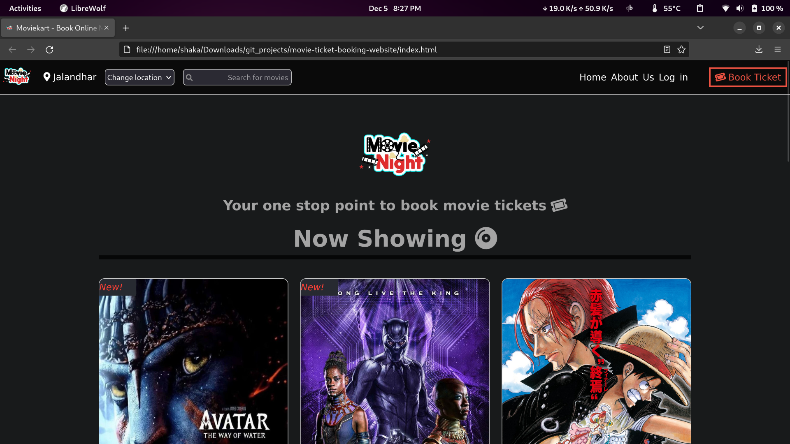
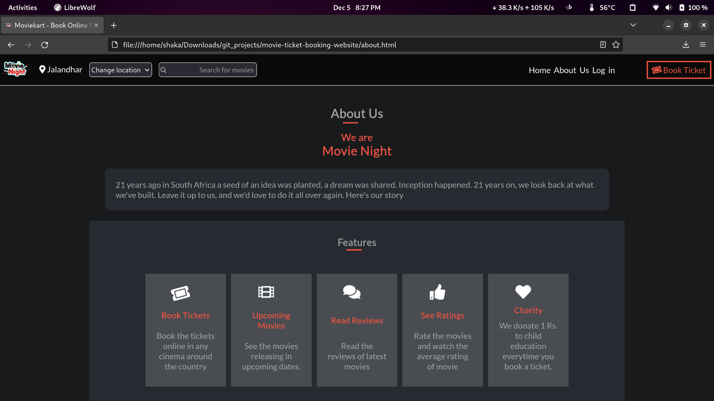
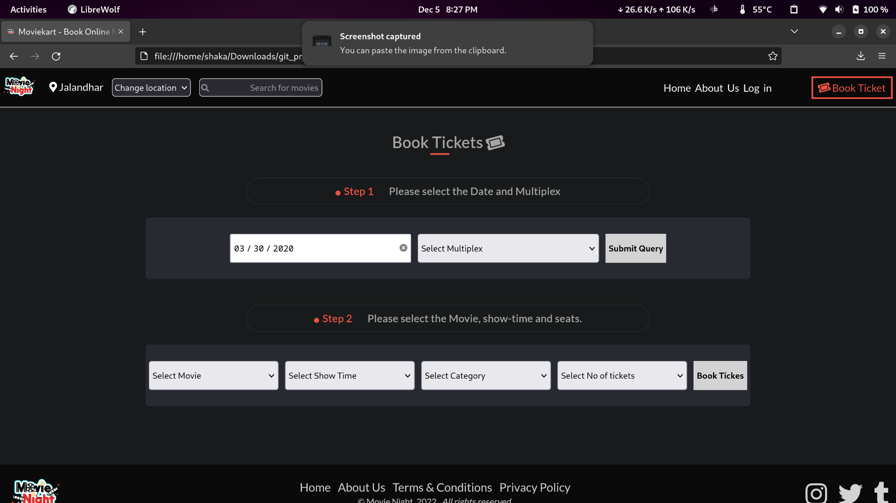

# Movie Tickets Booking Website [Group Project]
This project consists of building a responsive website for movie tickets booking. It has three responsive pages- a Homepage, booking page and an About page. All the pages have three responsive breakpoints for small, medium and large screens.
I have used CSS flexbox to make the pages responsive

>Screenshots

The purpose of this project is to create a responsive website to book movie tickets.

## Built With

- HTML
- CSS

## Live Demo

[Live Demo Link]()

## Getting Started

To get a local copy up and running follow these simple example steps:

#### Prerequisites

- You should have installed git on your local machine, and a text editor, preferably VS Code.

#### Setup

- Clone the repository into your local machine.
- Open index.html

## Potential Future Features
- It does not have a backend currently, so a backend server can be developed to make the website a fully functional application.

